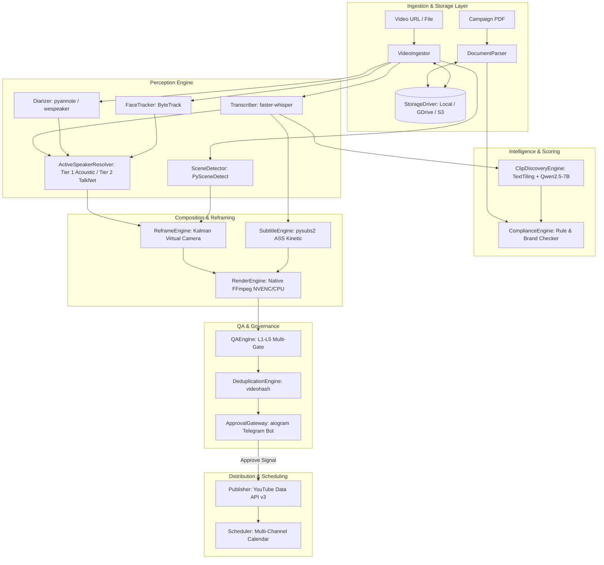

# CLIPPING AUTOMATION — SYSTEM ARCHITECTURE & COMPONENT SPECIFICATION

**Document Version:** 1.0.0  
**Status:** APPROVED ARCHITECTURAL BLUEPRINT  
**Project:** Clipping Automation

---

## 1. HIGH-LEVEL SYSTEM TOPOLOGY

The Clipping Automation platform is designed as a **decoupled, event-driven, modular pipeline**. Each subsystem is isolated behind a strict Python interface, communicating via immutable Pydantic data contracts.



---

## 2. ABSTRACT COMPONENT INTERFACES

All component interfaces are defined under `src/clipping/core/interfaces.py` and enforce strict typing and async execution.

### 2.1 StorageDriver Interface
```python
class StorageDriver(ABC):
    """Abstract interface for all media and artifact storage operations."""

    @abstractmethod
    async def save_file(self, local_path: str, destination_key: str) -> str:
        """Uploads/moves a local file to the storage vault and returns its URI."""
        pass

    @abstractmethod
    async def get_file(self, source_key: str, local_destination_path: str) -> str:
        """Downloads/retrieves a file from the vault to a local working path."""
        pass

    @abstractmethod
    async def file_exists(self, key: str) -> bool:
        """Checks if a file exists in the storage vault."""
        pass

    @abstractmethod
    async def get_stream_url(self, key: str) -> str:
        """Returns a streaming or signed URL for preview rendering."""
        pass
```

### 2.2 DocumentParser Interface
```python
class DocumentParser(ABC):
    """Parses raw campaign specification documents into structured CampaignSpec objects."""

    @abstractmethod
    async def parse_pdf(self, pdf_path: str, campaign_id: str) -> CampaignSpec:
        """Extracts structured rules, duration bounds, CTAs, and bounding boxes."""
        pass
```

### 2.3 VideoIngestor Interface
```python
class VideoIngestor(ABC):
    """Ingests source long-form videos from URLs or local paths."""

    @abstractmethod
    async def ingest(self, source_url: str, output_dir: str) -> SourceVideoMetadata:
        """Downloads/extracts master video, audio stream, and metadata."""
        pass
```

### 2.4 Transcriber & Diarizer Interfaces
```python
class Transcriber(ABC):
    """Extracts word-level timestamps and speech text from audio streams."""

    @abstractmethod
    async def transcribe(self, audio_path: str) -> List[WordTimestamp]:
        """Runs ASR with VAD filtering and cross-attention word alignment."""
        pass

class Diarizer(ABC):
    """Identifies multi-speaker turns and timestamps."""

    @abstractmethod
    async def diarize(self, audio_path: str) -> List[SpeakerSegment]:
        """Segments audio into distinct speaker IDs and intervals."""
        pass
```

### 2.5 ActiveSpeakerResolver Interface (Non-Mandatory ASD)
```python
class ActiveSpeakerResolver(ABC):
    """Associates speaking audio segments with visual face bounding boxes."""

    @abstractmethod
    async def resolve_active_speakers(
        self,
        scene_cuts: List[SceneCut],
        face_tracks: List[FaceTrack],
        speaker_segments: List[SpeakerSegment],
        audio_path: str,
        video_path: str
    ) -> List[ActiveSpeakerSegment]:
        """
        Tier 1: Geometric correlation between Diarization and Face Tracks.
        Tier 2 (Fallback): TalkNet-ASD neural lip-sync cross-attention.
        """
        pass
```

### 2.6 ReframeEngine Interface (Virtual Camera Director)
```python
class ReframeEngine(ABC):
    """Computes continuous 9:16 crop coordinates with Kalman trajectory smoothing."""

    @abstractmethod
    async def compute_reframe_plan(
        self,
        scene_cuts: List[SceneCut],
        active_speakers: List[ActiveSpeakerSegment],
        source_width: int,
        source_height: int,
        clip_start: float,
        clip_end: float
    ) -> ReframePlan:
        """Generates frame-by-frame crop coordinates, layout switches, and pans."""
        pass
```

### 2.7 SubtitleEngine & RenderEngine Interfaces
```python
class SubtitleEngine(ABC):
    """Generates animated ASS subtitle files with kinetic word-level styling."""

    @abstractmethod
    async def generate_subtitles(
        self,
        words: List[WordTimestamp],
        clip_start: float,
        clip_end: float,
        style_preset: str
    ) -> str:
        """Compiles word timestamps into ASS format with \k karaoke tags."""
        pass

class RenderEngine(ABC):
    """Executes hardware-accelerated video composition and transcoding."""

    @abstractmethod
    async def render_short(
        self,
        source_video_path: str,
        reframe_plan: ReframePlan,
        subtitle_ass_path: str,
        output_path: str
    ) -> str:
        """Runs FFmpeg filtergraph: crop, scale, ass burn, loudnorm, NVENC encode."""
        pass
```

### 2.8 QAEngine & DeduplicationEngine Interfaces
```python
class QAEngine(ABC):
    """Executes multi-layer quality assurance gates on rendered shorts."""

    @abstractmethod
    async def validate_clip(
        self,
        video_path: str,
        campaign_spec: CampaignSpec,
        clip_candidate: ClipCandidate
    ) -> QAResult:
        """Runs Level 1 (Structural), Level 2 (Visual), Level 3 (Audio), Level 4 (Compliance)."""
        pass

class DeduplicationEngine(ABC):
    """Detects duplicate clips and creates perceptual content fingerprints."""

    @abstractmethod
    async def check_duplicate(self, video_path: str) -> DuplicateCheckResult:
        """Computes perceptual hash and compares Hamming distance vs. published history."""
        pass
```

### 2.9 Telegram Human Approval Gateway Architecture
```python
class TelegramApprovalGateway:
    """Manages asynchronous human-in-the-loop clip review via dedicated Telegram bot."""
    
    async def dispatch_candidate_clips(
        self,
        job_id: str,
        source_video_id: str,
        ranked_candidates: List[RankedCandidate],
        render_outputs: Dict[str, RenderOutput],
        chat_id: int,
    ) -> List[ApprovalRequest]:
        """Dispatches rich HTML cards with compact inline callback buttons [APPROVE / REJECT]."""
        pass

    async def get_approval_summary(self, job_id: str) -> ApprovalSummary:
        """Computes aggregate approval metrics (total, approved, rejected, awaiting)."""
        pass

    async def get_approved_clips(self, job_id: str) -> List[ApprovalRequest]:
        """Returns verified approved clips ready for downstream publishing."""
        pass
```

- **Ephemeral Runner Safety:** GitHub Actions jobs dispatch approval cards to Telegram and exit immediately. No runner stays alive waiting for human intervention.
- **Durable Remote State:** Approvals and audit trails are persisted in Google Drive (`jobs/{id}/approvals/{req_id}.json` and `jobs/{id}/approvals/audit/`).
- **Callback Security & Replay Defense:** Strictly validates `allowed_user_ids` and `allowed_chat_ids`. Replay taps are idempotent no-ops. Callback payload (`v1:<A|R>:<id>`) stays under Telegram's 64-byte limit.
- **Consumer Dispatcher:** `TelegramApprovalDispatcher` consumes pending callbacks in batch mode (`.github/workflows/approval_poll.yml`), updating Drive state at $0 compute cost.

### 2.10 YouTube Publishing & Quota-Managed Scheduling Architecture
```python
class PublishingService:
    """Manages idempotent YouTube upload, gate enforcement, and remote audit logging."""
    
    async def publish_clip(
        self,
        job_id: str,
        clip_id: str,
        approval_request_id: str,
        video_storage_key: str,
        metadata: YouTubeVideoMetadata,
        expected_channel_id: Optional[str] = None,
        scheduled_publish_at: Optional[datetime] = None,
    ) -> PublishRequest:
        """Executes full upload lifecycle: gate check -> idempotency check -> channel verify -> upload -> audit."""
        pass
```

- **Approval Gate (Non-Negotiable):** Only clips with canonical `ApprovalStatus.APPROVED` in Google Drive state are published. `REJECTED` clips are marked `SKIPPED`, and `AWAITING_APPROVAL` clips are marked `DEFERRED`.
- **QA Gate:** Every clip must verify a valid `QAReport` with `can_publish = True` in remote storage before upload.
- **Idempotency & Race Protection:** Uses deterministic idempotency hash pointers (`publishing/by_idempotency/{hash}.json`). Duplicate workflow executions or retries detect existing `PUBLISHED` state and prevent duplicate uploads.
- **Scheduled Releases & Catch-up:** `PublishingScheduler` evaluates clips stored in `publishing/scheduled/`. If a scheduled cron is delayed, the subsequent run catches up on past-due clips without publishing future clips early.
- **YouTube API & Channel Limit Architecture:**
  The system strictly distinguishes three independent platform limits:
  1. **Google Cloud Project Quota:** The overall API unit allocation configured for the Google Cloud project in the Google Cloud Console (replenished at midnight Pacific Time).
  2. **`videos.insert` Granular Quota Bucket:** Per official YouTube Data API documentation, the December 4, 2025 API revision revised the documented `videos.insert` cost from ~1,600 units to ~100 units, and beginning June 1, 2026, YouTube transitioned `videos.insert` into dedicated, granular quota allocations separate from general search/read queries. The effective daily API upload capacity depends strictly on the project's configured quota bucket allocation, rather than an obsolete static calculation.
  3. **YouTube Channel-Level Daily Upload Limit:** YouTube enforces channel-level daily upload caps independent of API project quotas (based on channel age, account verification level, strike history, and regional policies). When this limit is reached, the API returns a 403 response with `uploadLimitExceeded`.
  - **Dynamic Error Classification & Deferral:**
    - `quotaExceeded` & `uploadLimitExceeded`: Classified as `RETRYABLE`. When encountered, the clip is marked `DEFERRED` (NOT permanently failed or skipped) with a future `scheduled_publish_at` timestamp, remaining safely in the scheduled index for automatic resumption.
    - `rateLimitExceeded` / HTTP 429 & HTTP 5xx: Classified as `RETRYABLE` with exponential backoff.
    - Permanent errors (HTTP 400 bad metadata, 401 invalid credentials, 403 `insufficientPermissions` / `accessNotConfigured`): Classified as `NON_RETRYABLE` and marked `FAILED`.

### 2.11 AL AMR Clipping Automation Console & Master Control Architecture
```python
class AmrMasterControlApp:
    """FastAPI & HTML5 media-first operations console and durable control plane."""
    
    # Read Endpoints (Unrestricted):
    # GET  /healthz                     -> Kubernetes / Render health probe
    # GET  /api/system/status           -> Health, 9-stage sequence, & control state
    # GET  /api/control/state           -> Durable control state & audit log
    # GET  /api/control/runs            -> Recent ephemeral GitHub Actions runs
    # GET  /api/jobs                    -> Active & historical production jobs
    # GET  /api/jobs/{job_id}           -> Detailed 9-stage transition history
    # GET  /api/jobs/{job_id}/clips     -> Discovered candidate clips with virality scores
    # GET  /api/jobs/{job_id}/publishing -> YouTube receipts & scheduled release slots
    
    # Mutating Endpoints (Operator Token Required):
    # POST /api/control/run-now         -> Workflow dispatch & canonical job creation
    # POST /api/control/emergency-stop  -> Cooperative freeze & global lock
    # POST /api/control/pause           -> Suspend scheduling
    # POST /api/control/resume          -> Clear emergency stop & pause locks
    # POST /api/control/publish-lock    -> Global YouTube Shorts publishing toggle
    # POST /api/control/cancel-job      -> Cooperative job cancellation
    # POST /api/control/retry-job       -> Requeue failed job to CREATED
    # POST /api/jobs/{job_id}/clips/{clip_id}/decision -> Mutates canonical Google Drive approval state
```

- **Product Identity:** **AL AMR Clipping Automation** (*Autonomous Video Intelligence & Vertical Media Engine*).
- **Canonical 9-Stage Sequence:**
  `01 INGESTION` $\rightarrow$ `02 TRANSCRIPTION` $\rightarrow$ `03 UNDERSTANDING` $\rightarrow$ `04 DISCOVERY` $\rightarrow$ `05 REFRAME` $\rightarrow$ `06 RENDER` $\rightarrow$ `07 QA` $\rightarrow$ `08 APPROVAL` $\rightarrow$ `09 PUBLISH`.
- **Durable Control Plane (`system/control_state.json`):**
  Global operating modes (`OPERATIONAL`, `AUTOMATION_PAUSED`, `EMERGENCY_STOPPED`) and flags (`publishing_locked`, `emergency_stopped`) persist directly in Google Drive, surviving container redeployments, browser refreshes, and runner terminations.
- **Emergency Stop & Cooperative Cancellation:**
  When `EMERGENCY_STOPPED` is activated, new workflow triggers are rejected (`can_start_new_jobs() == False`), publishing is deferred (`can_publish() == False`), and running workers check control state before transitions.
- **Security & Authorization Model:**
  Mutating operations require an authenticated operator (`X-Operator-Token` or `Authorization: Bearer <token>`). Privileged secrets (Google Service Account JSON, YouTube OAuth refresh tokens, Telegram bot tokens) are strictly held server-side and never exposed to client-side JavaScript.
- **Deployment Strategy (Render + GitHub Actions):**
  Lightweight FastAPI control plane runs on Render's free tier (handling UI, state mutations, and telemetry); heavy compute (Whisper transcription, face tracking, FFmpeg rendering) runs on ephemeral public GitHub Actions runners.

---

## 3. STATE MACHINE & DURABLE JOB PERSISTENCE

The pipeline maintains a durable, crash-resilient state machine backed by SQLite (local) or PostgreSQL (remote).

```
Pipeline State Transitions:
[CREATED]
   │
   ▼
[PARSING_CAMPAIGN] ────────► [FAILED_DOCUMENT]
   │
   ▼
[INGESTING_VIDEO] ─────────► [FAILED_INGESTION]
   │
   ▼
[TRANSCRIBING] ────────────► [FAILED_PERCEPTION]
   │
   ▼
[DIARIZING]
   │
   ▼
[DISCOVERING_CLIPS] ───────► [FAILED_INTELLIGENCE]
   │
   ▼
[REFRAMING_AND_RENDERING] ─► [FAILED_RENDER]
   │
   ▼
[RUNNING_QA] ──────────────► [FAILED_QA]
   │
   ▼
[AWAITING_APPROVAL] ──(Telegram Pause)──► [REJECTED] / [REGENERATING]
   │ (Human Approves)
   ▼
[QUEUED_FOR_PUBLISHING]
   │
   ▼
[PUBLISHING] ──────────────► [FAILED_PUBLISHING]
   │
   ▼
[PUBLISHED]
```

### Crash Recovery & Idempotency:
- Every pipeline activity writes an artifact manifest to the `StorageDriver` upon completion.
- If the worker process restarts mid-pipeline, it checks the database state and storage vault.
- If `clip_{id}_final.mp4` exists and matches its QA checksum, the workflow skips re-rendering and immediately resumes at `AWAITING_APPROVAL`.

---

## 4. SECRETS & CONFIGURATION ARCHITECTURE

Configuration is centralized in `src/clipping/core/config.py` using Pydantic Settings:

```python
class Settings(BaseSettings):
    # App & Environment
    ENVIRONMENT: Literal["development", "production", "test"] = "development"
    PROJECT_VAULT_ROOT: str = "./project_vault"
    DATABASE_URL: str = "sqlite+aiosqlite:///./project_vault/clipping.db"
    
    # Storage Configuration
    STORAGE_DRIVER: Literal["local", "gdrive", "s3"] = "local"
    GOOGLE_DRIVE_FOLDER_ID: Optional[str] = None
    GOOGLE_APPLICATION_CREDENTIALS: Optional[str] = None
    
    # Telegram Configuration
    TELEGRAM_BOT_TOKEN: str
    TELEGRAM_CHAT_ID: int
    TELEGRAM_SECRET_TOKEN: Optional[str] = None
    
    # YouTube Data API Configuration
    YOUTUBE_CLIENT_SECRETS_FILE: Optional[str] = "./secrets/client_secrets.json"
    YOUTUBE_CREDENTIALS_STORAGE_DIR: str = "./secrets/youtube_tokens"
    
    # Compute & Inference Settings
    INFERENCE_DEVICE: Literal["cpu", "cuda", "mps", "auto"] = "auto"
    LOCAL_LLM_BASE_URL: str = "http://localhost:11434/v1" # Ollama endpoint
    LOCAL_LLM_MODEL: str = "qwen2.5:7b-instruct-q4_K_M"
    
    class Config:
        env_file = ".env"
        extra = "ignore"
```

---

## 5. UI/UX INTEGRATION ARCHITECTURE (INDEPENDENT STUDIO UI)

```
┌─────────────────────────────────────────────────────────────────────────────┐
│                            CLIPPING STUDIO UI                               │
├─────────────────────────────────────────────────────────────────────────────┤
│ Frontend Stack: Next.js 14 (App Router) + TailwindCSS + Radix UI / Shadcn   │
│ Timeline Engine: react-timeline-editor (MIT Canvas/DOM Multi-Track)         │
│ Player / Preview: @remotion/player (Client-Side 9:16 Kinetic Video Canvas)  │
├─────────────────────────────────────────────────────────────────────────────┤
│ Main Views:                                                                 │
│ 1. Campaign Manager: PDF upload, extracted rules audit, brand assets        │
│ 2. Source Ingestor: YouTube URL / MP4 dropzone, perception progress         │
│ 3. Candidate Review Queue: Ranked cards, hook scores, compliance flags      │
│ 4. Studio Timeline Editor: Multi-track audio/video/caption fine-tuning      │
│ 5. Approval & Publishing Board: Telegram sync status, YouTube schedule     │
└─────────────────────────────────────────────────────────────────────────────┘
```

---

## 6. PRODUCTION ISOLATION, GITHUB SEPARATION & FONT DETERMINISM

### 6.1 Strict Repository & Account Isolation
- **Completely Independent Account & Repo:** Clipping Automation deployment is strictly targeted for a **NEW, SEPARATE GitHub account and repository**.
- **Zero Secret / Token Sharing:** No credentials, API secrets, tokens, or runners from existing accounts/repositories may ever be connected or referenced.
- **Remote Device Independence:** Runtime workers run autonomously on GitHub Actions Ubuntu runners; personal laptops/desktops serve purely as remote control interfaces.

### 6.2 Font Determinism on Linux Runners
- **Open-Source Font Fallback:** ASS subtitles configure standard cross-platform fonts (`Liberation Sans`, `DejaVu Sans`, `Arial Black`).
- **Cloud Runner Strategy:** In headless Linux runners (`ubuntu-latest`), standard font packages (`fonts-liberation`, `fonts-dejavu-core`) are pre-installed by default, ensuring pixel-accurate typography and preventing missing-glyph warnings without requiring manual host font installations.
