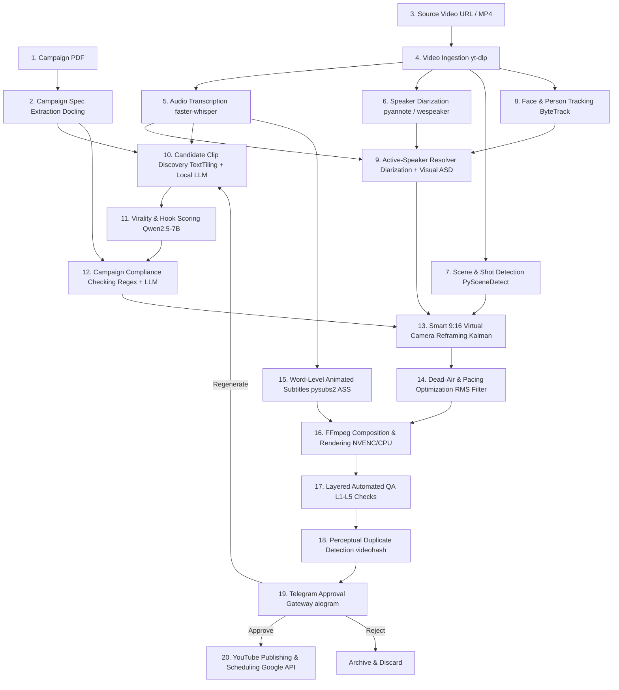
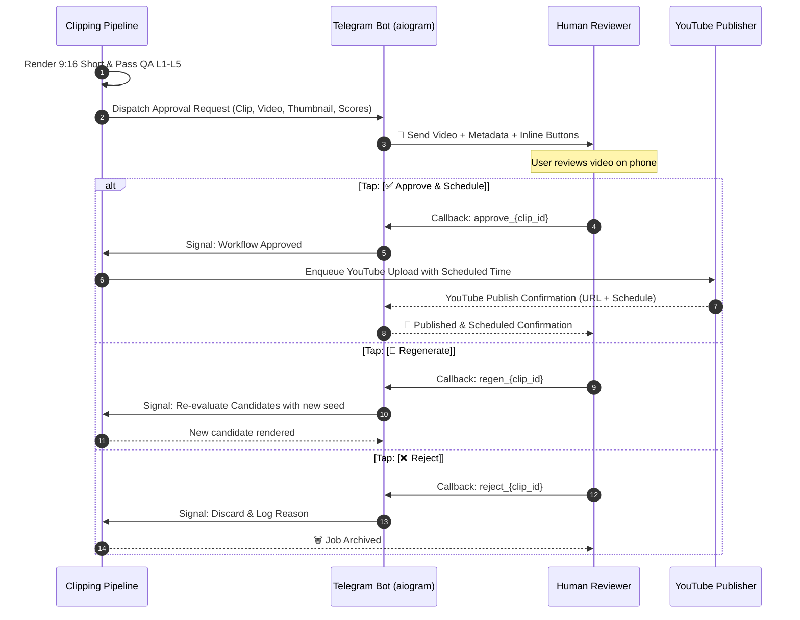

# CLIPPING AUTOMATION — MASTER SPECIFICATION

**Document Version:** 1.0.0  
**Status:** APPROVED ENGINEERING FOUNDATION  
**Project:** Clipping Automation (Independent System)

---

## 1. PROJECT PURPOSE & SCOPE

**Clipping Automation** is an autonomous, device-independent, zero-mandatory-cost software platform that ingests structured **Campaign PDF** specifications and long-form video content (interviews, podcasts, webinars, multi-speaker streams), and automatically produces platform-ready, high-retention 9:16 vertical shorts.

The system performs:
- End-to-end document understanding with source-span provenance.
- Multi-modal video and audio perception (speech-to-text, speaker diarization, visual shot cuts, face tracking, active-speaker resolution).
- Intelligent clip discovery, virality scoring, and campaign compliance verification.
- Dynamic 9:16 virtual camera reframing with cinematic trajectory smoothing.
- Kinetic word-level animated typography (ASS).
- Hardware-accelerated video composition and multi-layer automated QA.
- Asynchronous human-in-the-loop Telegram governance (Approve / Reject / Regenerate).
- Compliant YouTube Shorts publishing, queue scheduling, and lifecycle analytics.

---

## 2. NON-NEGOTIABLE CORE PRINCIPLES

### 2.1 Zero Mandatory Software & API Cost ($0 Target)
- **No Paid APIs:** The core production pipeline must never require paid LLM APIs (OpenAI, Gemini API, Anthropic), paid transcription APIs (AssemblyAI, Deepgram), paid TTS (ElevenLabs), or paid video generation/rendering SaaS (Remotion Cloud, Runway, Rephrase).
- **Self-Hosted Open Source Models:** All inference tasks use permissively licensed, open-weights models running locally or on self-hosted compute (`faster-whisper`, `pyannote`/`wespeaker`, `TalkNet-ASD`, `Qwen2.5-7B/14B-Instruct`).
- **Separation of Software Cost vs. Compute Cost:**
  - *Software License Cost:* Strictly **$0** (all software is free, open source, or public domain).
  - *Compute Cost:* **$0** when executed on available local hardware (CPU/GPU) or free-tier cloud environments; compute cost is restricted to raw hardware hosting if the user chooses to rent external cloud GPU instances (e.g., RunPod/Lambda Labs).

### 2.2 Device Independence
- **Zero Local Host Dependency:** The user's personal PC, local storage, and home internet connection must **not** be required for runtime execution.
- **Headless Cloud/Server Execution:** The system runs as a containerized, headless service on a remote VPS, cloud server, or dedicated worker node.
- **User Device as Remote Client:** Personal laptops, phones, or tablets serve exclusively as control interfaces (via Telegram bot and Web Studio UI).

### 2.3 Human Intervention Boundary
- **Full Autonomous Default:** The pipeline proceeds automatically from PDF upload through rendering and QA without requiring manual intervention.
- **Durable Approval Gateway:** The workflow suspends execution after rendering and automated QA, presenting the generated short, title, virality score, and compliance audit directly in Telegram with interactive buttons:
  - `[✅ Approve & Schedule]` $\rightarrow$ Queues video for YouTube upload.
  - `[🔄 Regenerate Candidates]` $\rightarrow$ Triggers re-selection with alternative prompt weights.
  - `[❌ Reject / Discard]` $\rightarrow$ Archives job and logs feedback.
- **Multi-Day Durable Pause:** The pipeline state machine must support pausing for minutes, hours, or days awaiting Telegram interaction without consuming CPU/memory or losing execution state.

### 2.4 Abstract Storage Architecture (5 TB Google Drive + Local Vault)
- **Decoupled Media I/O:** Media operations must never assume local disk access. All file operations go through the `StorageDriver` interface.
- **5 TB Google Drive Capability:** The primary cloud media vault integrates with the user's $\approx 5\text{ TB}$ Google Drive storage via service accounts / OAuth credentials.
- **Pluggable Backends:** The storage layer seamlessly supports:
  - `LocalVaultStorageDriver` (local filesystem / mounted volume).
  - `GoogleDriveStorageDriver` (Google Drive API / PyDrive2).
  - `S3StorageDriver` (MinIO / Cloudflare R2 / AWS S3).

### 2.5 Strict Project & UI Isolation (NOT AL AMR)
- **Completely Independent Repository:** Clipping Automation is developed in its own codebase with separate dependencies, configuration, and data models.
- **Zero AL AMR UI Duplication:** No layouts, stylesheets, navigation paradigms, or UI components from AL AMR will be used.
- **Custom Studio UI:** The web interface is built from the ground up using modern, open-source video timeline primitives (`react-timeline-editor` + `@remotion/player`) tailored specifically for clip review, candidate queues, active speaker framing inspection, and campaign rule management.

### 2.6 Strict Licensing Policy
- **Allowed Direct Dependencies:** Permissive licenses only: **MIT, Apache-2.0, BSD-2-Clause, BSD-3-Clause, ISC, Public Domain / Unlicense**.
- **Prohibited Direct Dependencies:** **AGPL-3.0, GPL-3.0, BSD-4-Clause** (with advertising clauses).
- **Reference-Only Policy:** Repositories with copyleft licenses (e.g., `OpenShorts`, `SupoClip`, `Marker`, `PyVideoTrans`) may be studied for algorithms and prompt structures, but zero lines of their source code may be copied into this project.

### 2.7 Clip Selection & Yield Policy (5–10 Clips per Source)
- **Minimum Desired Publishable Output:** 5 high-retention clips per long-form source.
- **Preferred / Hard Maximum Output:** Up to 10 clips per source video.
- **Strict Quality Floor:** The system must **NEVER** fabricate weak, low-scoring, or artificial clips merely to meet the quota of 5.
- **Under-Yield Behavior:** If fewer than 5 genuinely high-scoring, campaign-compliant clips exist after discovery, the system preserves and reports the exact valid candidates discovered and flags the run for human review.

### 2.8 Canonical 9-Stage Pipeline Architecture & Master Control
The pipeline execution and operations console are organized into exactly 9 canonical stages:
1. **01_INGESTION:** Source media downloading and audio/video stream demuxing (`yt-dlp` / FFmpeg).
2. **02_TRANSCRIPTION:** CPU-optimized word-level timestamped speech-to-text (`faster-whisper`).
3. **03_UNDERSTANDING:** Diarization, speaker turns, and shot cut detection (`pyannote` / PySceneDetect).
4. **04_DISCOVERY:** Semantic window candidate scoring and virality ranking (`Qwen2.5` / TextTiling).
5. **05_REFRAME:** Virtual camera 9:16 portrait tracking with Kalman smoothing.
6. **06_RENDER:** 1080x1920 composition with kinetic karaoke subtitles (`pysubs2` + FFmpeg).
7. **07_QA:** 5-layer automated quality assurance gate (media, audio LUFS, text bounds).
8. **08_APPROVAL:** Human-in-the-loop verification via Telegram Gateway and AL AMR Web Console.
9. **09_PUBLISH:** YouTube Data API v3 upload, metadata tagging, and quota-managed scheduling.

**Master Control & Emergency Operations:**
- Durable state in Google Drive (`system/control_state.json`) tracks `OPERATIONAL`, `AUTOMATION_PAUSED`, and `EMERGENCY_STOPPED`.
- Global Emergency Stop immediately halts job dispatch and locks YouTube publishing.
- Cooperative cancellation ensures cloud workers halt safely between pipeline stages without leaving orphaned state.

---

## 3. PROVEN ARCHITECTURAL LESSONS REUSED FROM YOUTUBE AUTOMATION

The design incorporates battle-tested architectural lessons from the YouTube Automation ecosystem:

1. **Quota Budgeting & Token Management:**
   - YouTube Data API v3 enforces quota buckets (incorporating the December 4, 2025 revision reducing `videos.insert` to ~100 units, and the June 1, 2026 transition to granular per-endpoint buckets) as well as separate channel-level daily upload caps.
   - *Architecture Reused:* Centralized error classification distinguishing `quotaExceeded`, `uploadLimitExceeded`, and `rateLimitExceeded`, automatically deferring publishing for future scheduler runs rather than failing permanently, and managing unattended OAuth2 token refresh loops with zero credential leakage.
2. **Resilient Chunked Uploads:**
   - Large video uploads can fail on unstable networks.
   - *Architecture Reused:* `MediaFileUpload` with chunked buffer uploads ($1\text{ MB}-5\text{ MB}$ chunks) and resume tokens, allowing uploads to recover from dropped connections without restarting from byte zero.
3. **Durable State Machine & Idempotency:**
   - Tasks may crash or be interrupted during long transcodes or network calls.
   - *Architecture Reused:* Persistent SQLite/Postgres task state tracking with idempotent activity execution. If a worker restarts, existing valid artifacts in the storage vault are verified via SHA-256 / size checks and skipped.
4. **Structured Logging & Event Sourcing:**
   - Debugging distributed video pipelines requires traceable context.
   - *Architecture Reused:* Context-bound JSON logging (`structlog`) attaching `campaign_id`, `source_video_id`, `clip_id`, and `step_name` to every log event.
5. **Zero-TOS-Violation Compliance:**
   - Unofficial browser scrapers and session cookie injectors violate platform policies and lead to account bans.
   - *Architecture Reused:* Strictly official Google APIs for publishing and authenticated `yt-dlp` format selection for ingestion.

---

## 4. COMPLETE 19-STEP CLIPPING PIPELINE TARGET



---

## 5. MODULAR SUBSYSTEM INTERFACES

Every subsystem is encapsulated behind a strict Python abstract base class (ABC) to ensure complete modularity and zero vendor lock-in.

```
┌─────────────────────────────────────────────────────────────────────────────┐
│                          CORE COMPONENT INTERFACES                          │
├───────────────────────────────┬─────────────────────────────────────────────┤
│ 1. DocumentParser             │ Parses PDFs into structured CampaignSpec    │
│ 2. StorageDriver              │ Unified I/O (Local Vault, GDrive, S3)       │
│ 3. VideoIngestor              │ Downloads & extracts media streams          │
│ 4. Transcriber                │ Word-level speech-to-text timestamps        │
│ 5. Diarizer                   │ Multi-speaker turn segmentation             │
│ 6. FaceTracker                │ Multi-person bounding box state tracking    │
│ 7. ActiveSpeakerResolver      │ Multi-modal speaker ↔ face association      │
│ 8. SceneDetector              │ Frame-accurate physical shot boundary cuts  │
│ 9. ClipDiscoveryEngine        │ Semantic candidate extraction & ranking     │
│ 10. ComplianceEngine          │ Validates rules, taboo words, and tone      │
│ 11. ReframeEngine             │ Computes smooth 9:16 virtual camera crops   │
│ 12. SubtitleEngine            │ Generates animated kinetic ASS scripts      │
│ 13. RenderEngine              │ FFmpeg composition & hardware transcoding   │
│ 14. QAEngine                  │ Layered structural, visual, and audio QA    │
│ 15. DeduplicationEngine       │ Perceptual video & audio fingerprinting     │
│ 16. ApprovalGateway           │ Telegram interactive human-in-the-loop bot  │
│ 17. Publisher                 │ YouTube Data API v3 upload & scheduling     │
│ 18. Scheduler                 │ Multi-channel distribution queue & calendar │
└─────────────────────────────────────────────────────────────────────────────┘
```

### Key Interface Design: `ActiveSpeakerResolver` (Non-Mandatory ASD)
Instead of forcing a heavy neural ASD model (like `TalkNet-ASD`) on every frame, the `ActiveSpeakerResolver` uses a multi-tier fallback architecture:

```python
class ActiveSpeakerResolver(ABC):
    """Abstract interface for associating active speech with visual face tracks."""
    
    @abstractmethod
    async def resolve_active_speakers(
        self,
        scene_cuts: List[SceneCut],
        face_tracks: List[FaceTrack],
        speaker_segments: List[SpeakerSegment],
        audio_stream_path: str,
        video_stream_path: str
    ) -> List[ActiveSpeakerSegment]:
        """
        Tier 1 (Baseline): Fast geometric & acoustic correlation between 
                          Pyannote speaker turns and ByteTrack face positions.
        Tier 2 (Optional High-Confidence Fallback): TalkNet-ASD neural lip-sync 
                          cross-attention model (activated only on ambiguous 
                          multi-speaker close-ups).
        """
        pass
```

---

## 6. HARDWARE & GPU COMPUTE STRATEGY

To ensure the system is completely device-independent and never assumes local hardware capabilities:

```
┌─────────────────────────────────────────────────────────────────────────────┐
│                    TIERED EXECUTION COMPUTE PROFILES                        │
├───────────────────────┬─────────────────────────────────────────────────────┤
│ PROFILE A: Pure CPU   │ • faster-whisper (INT8 quantized on CPU)            │
│ (Zero GPU Required)   │ • wespeaker / pyannote ONNX CPU runtime             │
│                       │ • PySceneDetect content detector                    │
│                       │ • ByteTrack CPU Kalman tracking                     │
│                       │ • Acoustic face association (Tier 1 ASD)            │
│                       │ • Qwen2.5-3B / 7B (Q4 GGUF via llama.cpp CPU)       │
│                       │ • FFmpeg libx264 software rendering                 │
│                       │ * Execution Speed: ~1.5x - 2.5x real-time           │
├───────────────────────┼─────────────────────────────────────────────────────┤
│ PROFILE B: Local GPU  │ • faster-whisper large-v3 (CUDA INT8/FP16)          │
│ (Optional 6-12GB VRAM)│ • pyannote-audio 3.1 PyTorch CUDA                   │
│                       │ • TalkNet-ASD active speaker neural model           │
│                       │ • Qwen2.5-7B / 14B (GGUF / vLLM on GPU)             │
│                       │ • FFmpeg h264_nvenc hardware transcoding            │
│                       │ * Execution Speed: ~8x - 15x real-time              │
├───────────────────────┼─────────────────────────────────────────────────────┤
│ PROFILE C: Remote GPU │ • Headless Docker worker on remote cloud VPS/GPU    │
│ (Serverless Worker)   │ • User device triggers jobs via Telegram/Web UI     │
│                       │ • Artifacts uploaded directly to Google Drive       │
└───────────────────────┴─────────────────────────────────────────────────────┘
```

---

## 7. LAYERED QA SPECIFICATION (5 DETERMINISTIC GATES)

Before requesting human approval in Telegram, every rendered short must pass a 5-level automated quality assurance gate:

1. **Level 1 — Structural QA:**
   - File exists, readable by FFprobe.
   - Exact resolution: $1080\times1920$ ($9:16$ vertical).
   - Frame rate: Constant $30.0$ or $60.0\text{ fps}$.
   - Audio: Stereo, $48,000\text{ Hz}$, AAC $\ge 192\text{ kbps}$.
2. **Level 2 — Visual QA:**
   - `blackdetect`: No black segments exceeding $0.3\text{ seconds}$.
   - `freezedetect`: No frozen video segments exceeding $0.5\text{ seconds}$.
   - Subtitle Safe-Zone: No caption bounding boxes outside $y \in [1100, 1600]$ (clearing platform UI overlays).
3. **Level 3 — Audio Loudness QA (EBU R128):**
   - Integrated Loudness: $-14.0\text{ LUFS} \pm 1.0\text{ LUFS}$ (mobile standard).
   - True Peak: $\le -1.0\text{ dBFS}$ (zero digital clipping).
   - Loudness Range (LRA): $\le 8.0\text{ LU}$ (consistent speech audibility).
4. **Level 4 — Semantic & Compliance QA:**
   - Zero occurrences of campaign prohibited words/topics.
   - Duration strictly within $[T_{\min}, T_{\max}]$ (e.g., $30\text{s}-60\text{s}$).
   - Presence of required Campaign CTA.
5. **Level 5 — Duplicate & Provenance QA:**
   - Perceptual video hash (`videohash` Hamming distance $\ge 4$ against all previously published clips).
   - Provenance manifest generated and cataloged.

---

## 8. TELEGRAM HUMAN-IN-THE-LOOP WORKFLOW



---

## 9. SECURITY & SECRETS ARCHITECTURE

- **Environment Isolation:** Secrets are never hardcoded or committed to git. All credentials (`TELEGRAM_BOT_TOKEN`, `TELEGRAM_CHAT_ID`, `GOOGLE_CLIENT_SECRETS_JSON`, `GOOGLE_DRIVE_FOLDER_ID`, `ENCRYPTION_KEY`) load via Pydantic Settings from `.env` or system environment variables.
- **OAuth Token Storage:** YouTube OAuth2 refresh tokens and Google Drive credentials are encrypted at rest using AES-256-GCM (`cryptography.fernet`) before storage in the project database.
- **Webhook Authentication:** Telegram webhook endpoints enforce secret token validation (`X-Telegram-Bot-Api-Secret-Token`).

---

## 10. REJECTED REPOSITORIES & APPROACHES

| Rejected Candidate | Reason for Rejection | Selected Alternative |
|---|---|---|
| `Anil-matcha/AI-Youtube-Shorts-Generator` | Toy prototype, static center crop, no error handling. | Modular custom pipeline |
| `ShortGPT` | Outdated SDKs, unstable MoviePy memory leaks. | Native FFmpeg NVENC/CPU |
| `mutonby/openshorts` | **AGPL-3.0** copyleft license risk. | Permissive MIT/Apache stack |
| `FujiwaraChoki/supoclip` | **AGPL-3.0** copyleft license risk. | Permissive MIT/Apache stack |
| `VikParuchuri/marker` | **GPL-3.0** license restriction. | `Docling` (MIT) |
| `huacnlee/pyvideotrans` | **GPL-3.0** license restriction. | `faster-whisper` + `pysubs2` |
| `m-bain/whisperX` | **BSD-4-Clause** legacy advertising clause. | Native `faster-whisper` + `pyannote` |
| `MoviePy` (for batch rendering) | High memory overhead, CPU bottlenecks, audio drift. | Native `FFmpeg` subprocess |
| Unofficial Browser YouTube Uploaders | Violates Google TOS; account termination risk. | Official `google-api-python-client` |
| Mandatory `TalkNet-ASD` | Too heavy for pure CPU execution. | `ActiveSpeakerResolver` tiered abstraction |

---

## 11. UNRESOLVED TECHNICAL QUESTIONS

1. **Google Drive API Upload Throughput:** Benchmark direct streaming upload via `GoogleDriveStorageDriver` vs. local staging buffer to ensure zero bottleneck during 4K long-form source ingestion.
2. **Lightweight Diarization on Pure CPU:** Measure the precision difference between `pyannote` (CPU ONNX) and `wespeaker-resnet34` for 2-person vs. 4-person podcast audio.
3. **Local LLM Structured JSON Latency:** Benchmark inference speed of `Qwen2.5-7B-Instruct` (Q4_K_M GGUF via llama-cpp-python) across candidate batch sizes on target host hardware.
