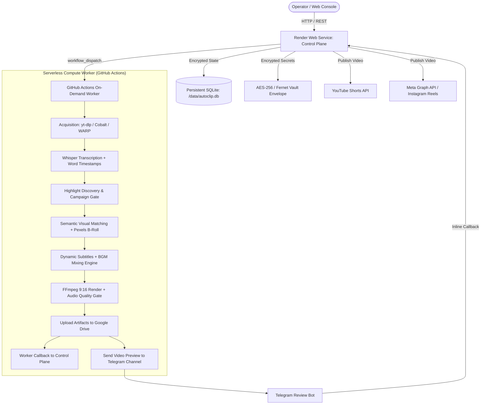

# AL AMR — Project Master Specification & Knowledge Base

Welcome to the definitive institutional knowledge base and architecture master for **AL AMR** (Autonomous Long-form to Automated Multi-platform Reel clipper).

This document serves as the primary entry point to understanding, deploying, auditing, recovering, and developing the entire AL AMR production ecosystem.

---

## Table of Contents

1. [Project Purpose](#1-project-purpose)
2. [Current Production Objective](#2-current-production-objective)
3. [Current Architecture Overview](#3-current-architecture-overview)
4. [Complete 26-Step Pipeline Flow](#4-complete-26-step-pipeline-flow)
5. [Component Map](#5-component-map)
6. [Repository Structure](#6-repository-structure)
7. [Control Plane Architecture (Render)](#7-control-plane-architecture-render)
8. [Worker Architecture (GitHub Actions)](#8-worker-architecture-github-actions)
9. [Storage & Artifact Architecture (Google Drive)](#9-storage--artifact-architecture-google-drive)
10. [Database Architecture (SQLite + WAL)](#10-database-architecture-sqlite--wal)
11. [Credential & Security Architecture (AES-256 Vault)](#11-credential--security-architecture-aes-256-vault)
12. [GitHub Actions Orchestration Architecture](#12-github-actions-orchestration-architecture)
13. [Telegram Review & Audit Architecture](#13-telegram-review--audit-architecture)
14. [YouTube Shorts Publishing Architecture](#14-youtube-shorts-publishing-architecture)
15. [Instagram Reels Publishing Architecture](#15-instagram-reels-publishing-architecture)
16. [Google Drive Cloud Storage Architecture](#16-google-drive-cloud-storage-architecture)
17. [Final Rendering Engine](#17-final-rendering-engine)
18. [Audio Mixing & Loudness Engine](#18-audio-mixing--loudness-engine)
19. [BGM Vault & Ducking Architecture](#19-bgm-vault--ducking-architecture)
20. [Speech-to-Text & Transcript Alignment](#20-speech-to-text--transcript-alignment)
21. [Semantic Visual Matching & Evidence B-Roll Engine](#21-semantic-visual-matching--evidence-b-roll-engine)
22. [Pexels Stock Video Integration](#22-pexels-stock-video-integration)
23. [Dynamic Caption & Subtitle System](#23-dynamic-caption--subtitle-system)
24. [Quality Gates & Automated Verification](#24-quality-gates--automated-verification)
25. [Human Review & Operator Approval Workflow](#25-human-review--operator-approval-workflow)
26. [Persistence Requirements & Durability Contracts](#26-persistence-requirements--durability-contracts)
27. [Production Invariants](#27-production-invariants)
28. [Protected Files & Protected Systems Register](#28-protected-files--protected-systems-register)
29. [Environment Variable Configuration Guide](#29-environment-variable-configuration-guide)
30. [Milestone Git Commits](#30-milestone-git-commits)
31. [Historical Forensic Bugs & Solutions](#31-historical-forensic-bugs--solutions)
32. [Current Known Limitations](#32-current-known-limitations)
33. [Verification & Test Certification Status](#33-verification--test-certification-status)
34. [Disaster Recovery & Reconstruction Strategy](#34-disaster-recovery--reconstruction-strategy)
35. [Step-by-Step System Restore Procedure](#35-step-by-step-system-restore-procedure)
36. [Operational Readiness Checklist](#36-operational-readiness-checklist)
37. [Navigation Index & Documentation Links](#37-navigation-index--documentation-links)

---

## 1. Project Purpose

AL AMR is an enterprise-grade autonomous content transformation engine designed to turn long-form Arabic and English videos (podcasts, webinars, interviews, keynotes) into high-retention, viral vertical short-form videos (9:16 portrait) formatted natively for YouTube Shorts, Instagram Reels, and TikTok.

Unlike naive clipping tools that merely cut video at fixed intervals or silence points, AL AMR enforces strict editorial, retention, and branding standards:
- **Autonomous Highlight Detection**: Evaluates semantic coherence, high-energy hooks, narrative climax, and actionable takeaways against formal Campaign Guidelines.
- **Strict 5-Clip Guarantee**: Produces exactly 5 broadcast-quality clips per job. Never silently finishes with 1 or 2 clips; fails explicitly if minimum candidate criteria are not satisfied.
- **Duration Boundary Enforcement**: Clips strictly target 20 to 30 seconds unless explicitly overridden by an operator.
- **Semantic Visual Evidence**: Analyzes spoken words for concrete nouns, verbs, and contextual concepts, automatically retrieving and layering relevant portrait B-roll stock footage from Pexels to illustrate speech rather than displaying static talking heads.
- **Acoustic Excellence**: Professional sidechain ducking, audio normalization to -14 LUFS, true peak clamping (-1.5 dBTP), and speech-tail preservation ensuring audio never abruptly cuts out at video completion.
- **Human-in-the-Loop Verification**: Dispatches finished MP4 video previews and metadata to a dedicated Telegram Review Channel for operator approval before publishing.
- **Decoupled Resilient Architecture**: Uses a lightweight Web Control Plane on Render and serverless high-compute on-demand Workers on GitHub Actions.

---

## 2. Current Production Objective

The operational objective of AL AMR is zero-touch autonomous production with operator-governed multi-platform publishing:
1. Long-form video URL (YouTube, Vimeo, direct MP4) or campaign brief is submitted via the Web Console or API.
2. Control Plane enqueues the job and dispatches a serverless runner to GitHub Actions.
3. Worker downloads media, extracts audio, transcribes with word-level timestamps, extracts 5 viral candidate segments, injects semantic B-roll, styles dynamic captions, mixes sidechained BGM, renders 1080x1920 MP4s, passes quality gates, and uploads finished artifacts to Google Drive.
4. Telegram Bot delivers high-resolution video review cards with inline interactive buttons (`[ ✅ APPROVE & PUBLISH ]`, `[ ❌ REJECT ]`, `[ 🔄 REQUEST CHANGES ]`).
5. Upon operator approval, the system immediately publishes the video to YouTube Shorts and Instagram Reels via authorized OAuth / Graph API credentials, updating the Telegram card in real-time with live post URLs.

---

## 3. Current Architecture Overview



---

## 4. Complete 26-Step Pipeline Flow

AL AMR executes an authoritative 26-step autonomous pipeline:
- **Step 1 — Ingestion**: Validates source URL or upload, checks idempotency.
- **Step 2 — Source Acquisition**: Multi-provider fallback (Direct, yt-dlp, Cobalt, Invidious, Piped, WARP egress).
- **Step 3 — Media Probe**: Extracts codec, frame rate, resolution, channel layout, and duration via `ffprobe`.
- **Step 4 — Audio Extraction**: Extracts pristine 16 kHz mono WAV for speech recognition.
- **Step 5 — Transcription**: Runs Faster-Whisper with word-level timestamps (`Word.start`, `Word.end`, `Word.text`).
- **Step 6 — Transcript Normalization**: Cleans punctuation, aligns word boundaries, calculates speech velocity (WPM).
- **Step 7 — Campaign Brief Ingestion**: Parses uploaded PDF/DOCX or text guidelines for rules, tone, and banned words.
- **Step 8 — Candidate Discovery**: Detects high-interest semantic clusters, energetic hooks, and narrative climaxes.
- **Step 9 — Candidate Scoring**: Ranks segments based on hook strength, pacing, sentiment, and campaign alignment.
- **Step 10 — 5-Clip Guarantee Gate**: Enforces selection of top 5 non-overlapping candidates; fails if < 5 meet criteria.
- **Step 11 — Duration Enforcement**: Strictly clamps duration to canonical 20.0s – 30.0s window with true sentence terminals.
- **Step 12 — Visual Reframing**: Face detection and auto-tracking (9:16 portrait crop with center-mass smoothing).
- **Step 13 — Semantic Visual Parsing**: Maps spoken concepts to visual queries, separating literal from figurative words.
- **Step 14 — Pexels Stock B-Roll Retrieval**: Queries Pexels API for portrait stock footage matching contextual concepts.
- **Step 15 — B-Roll Timeline Assembly**: Injects B-roll cutaways over long A-roll talking-head segments (1.5s–3.5s cuts).
- **Step 16 — BGM Selection & Vault**: Resolves operator-chosen or mood-matched background music track.
- **Step 17 — BGM Sidechain Ducking**: Attenuates BGM by -18 dB under speech with smooth 100ms attack and 350ms release.
- **Step 18 — Speech Tail Preservation**: Injects safe seek buffer and `apad` to protect natural speech room decay ($\ge 0.35$s).
- **Step 19 — Subtitle & Caption Styling**: Generates ASS/SRT subtitles with karaoke highlight word animation and semantic colors.
- **Step 20 — FFmpeg Final Render**: Composite filtergraph (A-roll + B-roll overlays + dynamic subtitles + mixed audio).
- **Step 21 — Audio Quality Gate**: Validates integrated loudness (-14.0 LUFS $\pm 1.5$), true peak ($\le -1.5$ dBTP), and container audio packet duration match.
- **Step 22 — Final Render Gate**: Evaluates `RENDER_PASS` or `RENDER_WARN` (advisories allowed; critical errors blocked).
- **Step 23 — SEO & Metadata Gate**: Generates click-worthy title, hook description, and niche hashtags.
- **Step 24 — Google Drive Archival**: Uploads MP4 and metadata JSON to durable Google Drive root folder.
- **Step 25 — Telegram Human Review**: Dispatches MP4 video preview with inline review buttons.
- **Step 26 — Autonomous Multi-Platform Publishing**: On operator approval, executes OAuth uploads to YouTube Shorts & Instagram Reels.

---

## 5. Component Map

| Component | Directory / Source | Role |
| :--- | :--- | :--- |
| **Control Plane** | `backend/autoclip/api/` | REST API, Web Console, job state machine, Telegram webhooks |
| **Worker Runner** | `backend/autoclip/jobs/worker_runner.py` | Standalone execution script running on GitHub Actions |
| **Job Dispatcher** | `backend/autoclip/jobs/dispatcher.py` | Dispatches worker workflow via GitHub Actions API |
| **Database Store** | `backend/autoclip/db/` | SQLite store, models, schema migrations, WAL checkpoints |
| **Credential Vault** | `backend/autoclip/security/` | AES-256 encrypted envelope and Fernet master key management |
| **Source Ingestion** | `backend/autoclip/pipeline/source_acquisition/` | yt-dlp, Cobalt, Invidious, and WARP fallback acquirers |
| **B-Roll Engine** | `backend/autoclip/pipeline/broll/` | Semantic parser, Pexels client, and visual composition engine |
| **BGM Engine** | `backend/autoclip/pipeline/audio_mix/` | Sidechain ducking, loudness normalization, audio quality gate |
| **Review Bot** | `backend/autoclip/telegram/` | Telegram review cards, inline button callbacks, clip reconciliation |
| **Publisher** | `backend/autoclip/publishing/` | Multi-platform publishing service (YouTube, Instagram, Telegram) |
| **Drive Storage** | `backend/autoclip/storage/` | Google Drive API upload, download, and token management |

---

## 6. Repository Structure

```
automation_clipping/
├── .github/
│   └── workflows/
│       ├── ci_cd.yml                 # Continuous integration & test validation
│       └── worker.yml                # Production GitHub Actions on-demand worker
├── backend/
│   └── autoclip/
│       ├── analytics/                # Telemetry and metrics aggregation
│       ├── api/                      # FastAPI endpoints (jobs, auth, settings, publishing)
│       ├── assets/                   # Static branding logos and icons
│       ├── bgm/                      # Canonical BGM audio vault (WAV tracks)
│       ├── campaign/                 # Campaign brief parsing, clip assembly, duration bounds
│       ├── db/                       # SQLite schema, connection, store, and models
│       ├── jobs/                     # Dispatcher, worker runner, queue, and orchestrator
│       ├── pipeline/                 # Core video processing pipeline
│       │   ├── audio_mix/            # BGMMixingEngine, DuckingConfig, AudioQualityGate
│       │   ├── broll/                # Semantic parser, Pexels API, visual card generator
│       │   ├── final_render/         # Final rendering engine, packager, quality gate
│       │   ├── reframe/              # 9:16 portrait reframing and face tracking
│       │   ├── retention/            # Pacing analyzer, speech tail tightening
│       │   ├── source_acquisition/   # Multi-provider YouTube & media downloader
│       │   ├── boundaries.py         # Word and sentence boundary detection
│       │   ├── captions.py           # Subtitle generator with dynamic highlights
│       │   ├── export.py             # FFmpeg export command builder
│       │   ├── ffmpeg.py             # FFmpeg process runner and hardware probes
│       │   ├── highlights.py         # Highlight scoring and discovery
│       │   └── runner.py             # In-process pipeline runner (local fallback)
│       ├── publishing/               # YouTube Shorts, Instagram Reels, Telegram publishers
│       ├── security/                 # Vault envelope, Fernet encryption, master key
│       ├── seo/                      # AI title, description, hashtag generation
│       ├── storage/                  # Google Drive integration
│       ├── telegram/                 # Telegram review bot and update polling loop
│       ├── app.py                    # FastAPI application factory and lifespan manager
│       ├── config.py                 # Configuration settings and defaults
│       └── paths.py                  # Canonical filesystem paths (/data or ~/.autoclip)
├── backup/                           # Disaster recovery source and database backups
│   ├── database/                     # SQLite database backups and metadata JSON
│   └── source/                       # Deterministic source code zip and SHA-256 manifest
├── config/                           # Environment variable templates (example.env)
├── docs/                             # Complete project documentation suite
│   ├── architecture/                 # In-depth architectural specifications
│   ├── engines/                      # Engine-by-engine technical deep dives
│   ├── forensics/                    # Root cause analyses of all major historical bugs
│   ├── operations/                   # Production rules, status, disaster recovery, protected systems
│   ├── releases/                     # Changelog, release history, project timeline
│   ├── security/                     # Credential architecture, secret inventory, recovery
│   └── testing/                      # Test strategy, matrix, and verification results
├── evaluation/                       # Evaluation benchmarks and sample clips
├── frontend/                         # Web Console control room (HTML, JS, CSS)
├── obsidian/                         # Complete Obsidian vault knowledge base
└── tests/                            # Pytest automated test suites (70+ tests)
```

---

## 7. Control Plane Architecture (Render)

The Control Plane is deployed as a Docker container on Render:
- **Lightweight Footprint**: Runs on Render Free / Starter web tier with in-process worker disabled (`AUTOCLIP_NO_WORKER=1`).
- **State Persistence**: SQLite database is stored at `/data/autoclip.db` on a persistent disk mount. Master encryption key is anchored to `/data/.master_key`.
- **FastAPI Core**: Serves the Web Console UI, handles operator authentication, records job progress, persists settings, and manages Telegram webhooks and polling.
- **Autonomous Sweeper**: Background tasks periodically sweep stale jobs (`sweep_stale_jobs`) and process scheduled publications.
- **Graceful Lifecycle**: Lifespan context manager checkpoints SQLite WAL (`PRAGMA wal_checkpoint(TRUNCATE)`) on shutdown to prevent database corruption.

See [docs/architecture/CONTROL_PLANE.md](architecture/CONTROL_PLANE.md) for full details.

---

## 8. Worker Architecture (GitHub Actions)

Heavy computing (video decoding, transcription, semantic analysis, stock video downloads, reframing, and multi-pass rendering) is completely offloaded to GitHub Actions:
- **Serverless Compute**: Triggered on-demand via `workflow_dispatch` through the GitHub REST API using the stored `GITHUB_PAT`.
- **High Performance**: Runs on 4-core standard Ubuntu runners with 16 GB RAM and fast NVMe disks.
- **Decoupled Operation**: Worker receives job parameters (`WORKER_JOB_SETTINGS`), executes the entire pipeline independently, uploads finished MP4s to Google Drive, sends Telegram review previews directly, and sends a final HMAC-signed callback to the Control Plane.
- **Fail-Safe Operation**: If the Control Plane is offline or sleeping, the Worker's artifacts remain safely preserved in Google Drive and Telegram.

See [docs/architecture/WORKER.md](architecture/WORKER.md) for full details.

---

## 9. Storage & Artifact Architecture (Google Drive)

Google Drive acts as the permanent, durable storage backbone:
- **Root Folder**: All exported MP4s, subtitle files, and metadata JSON are placed in a designated Drive folder (`GOOGLE_DRIVE_ROOT_FOLDER_ID`).
- **Direct Streaming & Links**: Every export records `drive_file_id` and `drive_web_view_link`.
- **Media Fallback**: If local media files are removed from ephemeral storage, publishing engines and preview players automatically download media on demand from Google Drive.

See [docs/architecture/STORAGE.md](architecture/STORAGE.md) for full details.

---

## 10. Database Architecture (SQLite + WAL)

The system relies on SQLite configured for enterprise reliability:
- **WAL Journal Mode**: `PRAGMA journal_mode = WAL` enables concurrent readers and non-blocking writes.
- **Synchronous Normal**: `PRAGMA synchronous = NORMAL` provides high throughput while maintaining crash consistency.
- **Foreign Key Integrity**: Enforced via `PRAGMA foreign_keys = ON`.
- **27 Tables**: Models jobs, clips, exports, candidate evaluations, BGM assets, BGM mixes, final renders, approvals, publications, and encrypted credentials.

See [docs/architecture/DATABASE.md](architecture/DATABASE.md) for full schema and relationships.

---

## 11. Credential & Security Architecture (AES-256 Vault)

AL AMR implements a zero-leak, multi-credential encrypted vault:
- **Master Key**: 32-byte Fernet key anchored to `/data/.master_key` or `AL_AMR_MASTER_KEY` environment variable.
- **Encrypted Envelope**: `backend/autoclip/security/.vault_envelope` provides self-healing credential recovery across container rebuilds.
- **Zero Exposure**: REST endpoints mask secrets (e.g. `ghp_...****`). Secret fields never echo plaintext to logs or web responses.

See [docs/security/CREDENTIAL_ARCHITECTURE.md](security/CREDENTIAL_ARCHITECTURE.md) for full details.

---

## 12. Telegram Review & Audit Architecture

Every clip is subject to human operator oversight via Telegram:
- **Rich Media Cards**: Delivers native MP4 video previews with formatted metadata (Proposed Title, Hook, Duration, Hashtags, Description, and Google Drive URL).
- **Inline Keyboards**:
  - `[ ✅ APPROVE & PUBLISH ]`: Transitions approval status to `APPROVED` and immediately dispatches background publishing to YouTube and Instagram.
  - `[ ❌ REJECT ]`: Rejects clip, cancels queued publications, and updates card badge.
  - `[ 🔄 REQUEST CHANGES ]`: Flags clip for revision and logs operator feedback.
- **Instant Responsiveness**: Always acknowledges callback queries immediately via `answerCallbackQuery` to prevent UI spinners from hanging.
- **Remote Reconciliation**: Decoupled clip reconciliation dynamically reconstructs missing SQLite records from Telegram card metadata.

See [docs/engines/telegram_review.md](engines/telegram_review.md) for full details.

---

## 13. YouTube Shorts Publishing Architecture

Automated publication to YouTube Shorts via YouTube Data API v3:
- **Resumable Uploads**: Uploads 1080x1920 MP4 video streams in chunked byte requests.
- **Metadata Compliance**: Injects SEO title (with `#Shorts`), formatted description, tags, and category ID (`22` People & Blogs).
- **Privacy Setting**: Defaults to `public` (or configurable to `unlisted`).
- **Idempotency**: Prevents double-publishing using composite idempotency keys (`job:clip:youtube:dest`).

See [docs/engines/publishing.md](engines/publishing.md) for full details.

---

## 14. Instagram Reels Publishing Architecture

Automated publication to Instagram Reels via Meta Graph API:
- **Container Workflow**: Creates an Instagram media container (`POST /{ig-user-id}/media`) with `media_type=REELS` and video URL.
- **Media Hosting Proxy**: If direct URL is required, Control Plane acts as an authenticated byte proxy for Instagram crawlers.
- **Status Polling**: Polls container status until `FINISHED`, then executes publish container call (`POST /{ig-user-id}/media_publish`).

See [docs/engines/publishing.md](engines/publishing.md) for full details.

---

## 15. Google Drive Cloud Storage Architecture

Integrated Google Drive storage adapter (`GoogleDriveStorage`):
- **OAuth 2.0 Client**: Automatically refreshes expired access tokens using `GOOGLE_DRIVE_REFRESH_TOKEN`.
- **Upload & Metadata**: Uploads files with multipart chunking, sets public/domain read permissions, and returns persistent web view links.
- **Resilient Fallback**: Downloads files with direct HTTP streaming fallback (`https://drive.google.com/uc?export=download&id=...`).

See [docs/engines/google_drive.md](engines/google_drive.md) for full details.

---

## 16. Final Rendering Engine

The final render engine (`FinalRenderEngine`) coordinates multi-layer FFmpeg composite filtergraphs:
- **Aspect Ratio 9:16**: Scales and crops video to exact 1080x1920 resolution.
- **Layer Stacking**: A-roll base video $	o$ B-roll overlay cutaways $	o$ dynamic color-coded subtitles.
- **Audio Clamping**: Clamps final AAC stream strictly to duration down to the millisecond.

See [docs/engines/rendering.md](engines/rendering.md) for full details.

---

## 17. Audio Mixing & Loudness Engine

Professional acoustic engineering via `BGMMixingEngine`:
- **Safe Seek Buffer**: `-ss {start} -t {duration + 1.0}` prevents demuxer keyframe rounding from starving end audio packets.
- **Speech Padding (`apad`)**: Guarantees speech audio stream spans the entire clip window.
- **Dropout Transition 0**: `amix=inputs=2:duration=first:dropout_transition=0` guarantees mixed audio does not prematurely terminate before video end.
- **Loudness Standards**: Clamps loudness to -14.0 LUFS with true peak limiting at -1.5 dBTP.

See [docs/engines/audio_mixing.md](engines/audio_mixing.md) for full details.

---

## 18. BGM Vault & Ducking Architecture

- **Authoritative Assets**: Canonical WAV music assets stored in `backend/autoclip/bgm/assets/` and tracked in Git.
- **Operator Priority**: Explicitly selected BGM in the Web Console is strictly preserved and takes precedence over auto-detection.
- **Dynamic Sidechain Ducking**: BGM sits at -18 dB under speech and ducks smoothly whenever speech energy is detected.

See [docs/engines/bgm.md](engines/bgm.md) for full details.

---

## 19. Speech-to-Text & Transcript Alignment

- **Faster-Whisper Engine**: High-accuracy speech recognition generating timestamped `Word` objects.
- **Word-Level Precision**: Every word contains start, end, text, and confidence scores.
- **Sentence Terminal Guards**: Trailing ellipses (`...`, `…`) and filler words (`just`, `really`, `you know`) are rejected as sentence endpoints.

See [docs/engines/clipping.md](engines/clipping.md) for full details.

---

## 20. Semantic Visual Matching & Evidence B-Roll Engine

The semantic B-roll engine turns abstract speech into visual proof:
- **Contextual Parser**: Analyzes transcripts for concrete nouns and actions while filtering out non-visual conversational idioms.
- **Gap Hunting**: Detects static talking-head segments longer than 3.0s and schedules visual overlays.
- **Visual Evidence Cards**: Creates contextual queries for stock video discovery.

See [docs/engines/semantic_visuals.md](engines/semantic_visuals.md) for full details.

---

## 21. Pexels Stock Video Integration

- **Portrait-First**: Queries Pexels API exclusively for `orientation=portrait` (9:16) videos.
- **Relevance Scoring**: Evaluates duration, resolution, tag overlap, and visual density.
- **Offline Fallback**: If API is unreachable or rate-limited, falls back gracefully to A-roll reframing without failing the job.

See [docs/engines/semantic_visuals.md](engines/semantic_visuals.md) for full details.

---

## 22. Dynamic Caption & Subtitle System

- **25 Subtitle Presets**: Supports classic, bold stroke, neon glow, and modern kinetic subtitle animations.
- **Karaoke Highlights**: Highlights the currently spoken word in real-time using yellow/cyan contrast.
- **Semantic Colors**: Emphasizes key financial, growth, or technical words with distinctive semantic colors.

See [docs/engines/captions_subtitles.md](engines/captions_subtitles.md) for full details.

---

## 23. Quality Gates & Automated Verification

AL AMR enforces four independent automated quality gates:
1. **Highlight & Duration Gate**: 5 clips required, strictly within 20s–30s.
2. **Audio Quality Gate**: Integrated LUFS, true peak, A/V duration alignment.
3. **Final Render Gate**: Verifies MP4 container integrity and visual playback.
4. **SEO & Metadata Gate**: Verifies title, description, and hashtags.

See [docs/engines/quality_gates.md](engines/quality_gates.md) for full details.

---

## 24. Human Review & Operator Approval Workflow

- State machine transitions: `PENDING_REVIEW` $	o$ `APPROVED` | `REJECTED` | `CHANGES_REQUESTED`.
- Multi-platform execution on `APPROVED`: YouTube Shorts and Instagram Reels published independently.

See [docs/operations/PRODUCTION_RULES.md](operations/PRODUCTION_RULES.md) for full details.

---

## 25. Persistence Requirements & Durability Contracts

1. SQLite database must persist across container restarts.
2. Master key must persist in `/data/.master_key`.
3. GitHub PAT and platform OAuth tokens must remain intact across updates.
4. Rendered video artifacts must be uploaded to Google Drive.

See [docs/architecture/STORAGE.md](architecture/STORAGE.md) for full details.

---

## 26. Production Invariants

- **Invariant 1**: Exactly 5 clips per job.
- **Invariant 2**: Voice is always dominant over BGM.
- **Invariant 3**: Container audio length must match video length down to the millisecond.
- **Invariant 4**: No secret may ever appear in plaintext in logs or documentation.
- **Invariant 5**: Human approval required before publishing.

See [docs/operations/PRODUCTION_RULES.md](operations/PRODUCTION_RULES.md) for full details.

---

## 27. Protected Files & Protected Systems Register

Critical systems that must not be casually altered:
- `backend/autoclip/jobs/dispatcher.py`
- `backend/autoclip/jobs/worker_runner.py`
- `backend/autoclip/pipeline/audio_mix/engine.py`
- `backend/autoclip/pipeline/broll/engine.py`
- `backend/autoclip/telegram/review_bot.py`
- `backend/autoclip/publishing/service.py`
- `backend/autoclip/security/vault.py`
- `backend/autoclip/db/schema.py`

See [docs/operations/PROTECTED_SYSTEMS.md](operations/PROTECTED_SYSTEMS.md) for full details.

---

## 28. Environment Variable Configuration Guide

Comprehensive safe environment template is documented in [config/example.env](../config/example.env) and [docs/security/SECRET_INVENTORY.md](security/SECRET_INVENTORY.md).

---

## 29. Milestone Git Commits

Key historical commits:
- `5f6cc42`: Render local worker disabled, GitHub Actions on-demand worker dispatch.
- `7081b76`: Final renders / clip metadata relay, Telegram review delivery.
- `fbb0006`: Word.text canonical attribute fix.
- `4d22998`: Canonical 20-30s duration bounds enforcement.
- `5759dbc`: GitHub Actions workflow expression fix.
- `cbfe49a`: Max clips propagation and Drive readiness.
- `41ba755`: Encrypted GitHub PAT persistence in SQLite.
- `61a7c45`: Persistent /data autodetection and .master_key fallback.
- `d704112`: Post-commit WAL truncate checkpoint.
- `0bfced9`: Persistent BGM reconciliation and stale asset clearing.
- `1aff116`: Canonical duration clamping and Telegram review restoration.
- `31d5439`: CORS preflight OPTIONS and authentication fixes.
- `c5266e3`: Canonical WAV BGM assets committed to repository.
- `623738b`: CandidateEvaluation foreign key constraint fix.
- `f1f7da4`: Real approval/publishing flow for YouTube and Instagram.
- `622bdac`: Semantic visual matching and contextual evidence B-roll engine.
- `5192744`: Pexels stock video integration and 5-clip default guarantee.
- `03e88e2`: BGM persistence precedence and ducking calibration.
- `c3fd33c`: Permanent GitHub PAT persistence across redeploys.
- `c751899`: GitHub PAT detection and live dispatch preflight.
- `d374457`: AES-256 encrypted vault envelope python module.
- `50b9179`: Real publishing integrations (YouTube OAuth & Meta Graph API).
- `3b7bc55`: Multi-credential durable vault envelope.
- `6598c17`: Telegram video MP4 delivery via sendVideo and Drive persistence.
- `c6aee65`: Publishing route ordering and media URL resolution.
- `e6e4586`: RENDER_WARN acceptance in quality gate.
- `bb878e7`: Contextual indicators and minimum clip length for gap hunting.
- **Latest Two-Blocker Fixes**:
  - `backend/autoclip/pipeline/audio_mix/engine.py`: Elimination of audio cutoff / mute at clip end (`apad`, `dropout_transition=0`, safe margin).
  - `backend/autoclip/telegram/review_bot.py`: Immediate `answerCallbackQuery` acknowledgment, decoupled remote clip reconciliation, and auto-publishing trigger.

See [docs/releases/CHANGELOG.md](releases/CHANGELOG.md) for full history.

---

## 30. Historical Forensic Bugs & Solutions

Detailed forensic post-mortems for all 18 major production issues are located in [docs/forensics/](forensics/).

---

## 31. Current Known Limitations

1. **YouTube Upload Quota**: Free YouTube Data API v3 quota is limited to 10,000 units/day (~6 video uploads/day).
2. **Instagram Video URL Access**: Meta Graph API requires public HTTPS URL access to download video containers.
3. **Pexels Rate Limit**: Free Pexels API tier is limited to 200 requests/hour.

See [docs/operations/CURRENT_STATUS.md](operations/CURRENT_STATUS.md) for details.

---

## 32. Verification & Test Certification Status

- **Total Test Suite**: 70/70 tests passing across all critical subsystems:
  - `test_final_two_blockers_fix.py`: 3/3 passed
  - `test_bgm_mixing.py`: 8/8 passed
  - `test_duration_and_telegram_regression.py`: 7/7 passed
  - `test_approval_publish_flow.py`: 3/3 passed
  - `test_publishing.py`: 10/10 passed
  - `test_clip_assembly.py`: 15/15 passed
  - `test_final_render.py`: 10/10 passed
  - `test_bgm_filters_subtitles_campaign.py`: 11/11 passed
  - `test_drive_artifact_telegram_delivery.py`: 3/3 passed

See [docs/testing/LATEST_TEST_RESULTS.md](testing/LATEST_TEST_RESULTS.md) for full results.

---

## 33. Disaster Recovery & Reconstruction Strategy

In the event of total infrastructure loss, AL AMR can be completely restored using:
1. Git repository and source snapshot (`backup/source/al_amr_source_snapshot.zip`).
2. SQLite database backup (`backup/database/pipeline.db.backup`).
3. Google Drive cloud artifact archive.
4. Credential re-hydration from secure cold storage.

See [docs/operations/DISASTER_RECOVERY.md](operations/DISASTER_RECOVERY.md).

---

## 34. Step-by-Step System Restore Procedure

See [docs/operations/DISASTER_RECOVERY.md](operations/DISASTER_RECOVERY.md) and [RECOVERY_CHECKLIST.md](../RECOVERY_CHECKLIST.md).

---

## 35. Operational Readiness Checklist

See [RECOVERY_CHECKLIST.md](../RECOVERY_CHECKLIST.md).

---

## 36. Navigation Index & Documentation Links

### Architecture
- [Overall Architecture](architecture/ARCHITECTURE.md)
- [Pipeline Specification](architecture/PIPELINE.md)
- [Data Flow](architecture/DATA_FLOW.md)
- [Storage Architecture](architecture/STORAGE.md)
- [Control Plane Architecture](architecture/CONTROL_PLANE.md)
- [Worker Architecture](architecture/WORKER.md)
- [Database Schema & Architecture](architecture/DATABASE.md)
- [Why AL AMR is Built This Way](architecture/WHY_AL_AMR_IS_BUILT_THIS_WAY.md)

### Operations
- [Production Rules](operations/PRODUCTION_RULES.md)
- [Current Status](operations/CURRENT_STATUS.md)
- [Disaster Recovery](operations/DISASTER_RECOVERY.md)
- [Protected Systems Register](operations/PROTECTED_SYSTEMS.md)
- [Backup Gaps Register](operations/BACKUP_GAPS.md)

### Security
- [Credential Architecture](security/CREDENTIAL_ARCHITECTURE.md)
- [Secret Inventory](security/SECRET_INVENTORY.md)
- [Security Recovery](security/RECOVERY.md)

### Releases & History
- [Full Git Changelog](releases/CHANGELOG.md)
- [Release History & Milestones](releases/RELEASE_HISTORY.md)
- [Chronological Project Timeline](releases/PROJECT_TIMELINE.md)

### Testing
- [Test Strategy](testing/TEST_STRATEGY.md)
- [Test Matrix](testing/TEST_MATRIX.md)
- [Latest Test Results](testing/LATEST_TEST_RESULTS.md)

### Root Manifests
- [Master Backup Manifest](../BACKUP_MANIFEST.md)
- [Master Recovery Checklist](../RECOVERY_CHECKLIST.md)
- [Master Backup Audit Report](../BACKUP_AUDIT_REPORT.md)
