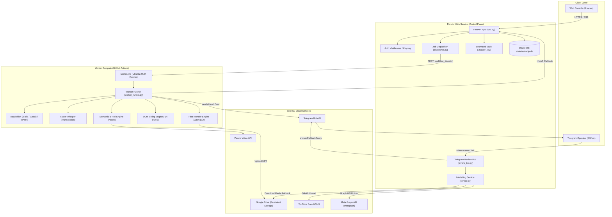

# AL AMR — System Architecture Specification

## 1. System Philosophy

AL AMR is engineered around five fundamental design principles:
1. **Asymmetric Resource Utilization**: Lightweight, cost-efficient Web Control Plane (Render Free / Starter tier) coupled with elastic, high-performance serverless compute workers (GitHub Actions 4-core runners).
2. **Deterministic Durability**: Every critical state transition, artifact pointer, and credential is persisted in durable SQLite and Google Drive.
3. **Decoupled Autonomous Execution**: Workers can run to completion even if the Control Plane goes offline; finished artifacts and review cards are delivered directly to Google Drive and Telegram.
4. **Zero-Leak Security**: Multi-credential encrypted vault with AES-256 / Fernet envelopes, ensuring credentials never touch disk in plaintext or leak in logs.
5. **Human Governance**: Automated production with mandatory human approval before external publishing.

---

## 2. End-to-End System Diagram

---

## 3. Subsystem Breakdown

### 3.1 Control Plane (`backend/autoclip/api/`, `app.py`)
- **Hosting**: Render Web Service running Docker container.
- **Port**: Listens on port 10000 (standard Render port).
- **Filesystem**: Mounted persistent disk at `/data` (`/data/autoclip.db` and `/data/.master_key`).
- **Worker Mode**: In-process worker is disabled by default (`AUTOCLIP_NO_WORKER=1`).
- **Endpoints**:
  - `/api/jobs`: Job creation, status polling, cancellation, settings.
  - `/api/jobs/worker_callback`: HMAC-authenticated callback endpoint for worker results.
  - `/api/publishing`: Multi-platform publication records, manual retry, destination settings.
  - `/api/telegram/webhook`: Incoming Telegram callback queries.
  - `/api/settings`: Dynamic settings, credential vault enrollment, health diagnostics.

### 3.2 Worker Runner (`backend/autoclip/jobs/worker_runner.py`)
- **Environment**: Ubuntu 24.04 LTS runner in GitHub Actions.
- **Dependencies**: Python 3.11, FFmpeg with libx264/aac/fontconfig, Faster-Whisper, MediaPipe, Pillow.
- **Inputs**: Environment variables or JSON payload (`WORKER_JOB_SETTINGS`).
- **Outputs**:
  - MP4 video files (1080x1920, 30 fps, AAC 48 kHz).
  - Telemetry and quality gate metrics.
  - Google Drive upload file IDs and links.
  - Telegram review messages with inline keyboard markup.

### 3.3 Data Layer (`backend/autoclip/db/`)
- **Engine**: SQLite 3 with WAL journal mode.
- **Tables**: 27 normalized tables covering jobs, sources, clips, exports, candidates, metadata, approvals, publications, and credentials.
- **Concurrency**: Handled via Python context manager (`with connection() as conn:`) with thread-local pooling.

---

## 4. Disaster Resilience Principles
- **Stateless Workers**: Workers hold zero persistent local state. If a runner crashes, the job is cleanly retried.
- **Self-Healing State**: If SQLite state is lost, Telegram review card text and Drive file IDs dynamically reconstruct missing records on button click.
- **Master Key Continuity**: Key is anchored to disk, ensuring secrets remain decryptable across restarts.
