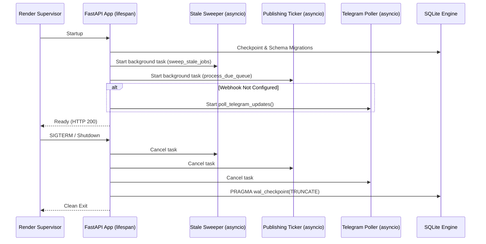

# AL AMR — Control Plane Architecture (Render)

## 1. Responsibilities

The Control Plane (`backend/autoclip/api/`, `app.py`) serves as the central command node:
- **API & Console Gateway**: Exposes REST APIs for Web Console UI, Android client, and administrative tools.
- **Orchestration**: Manages job creation, validation, dispatching, and status polling.
- **Durable Vault**: Manages AES-256 encrypted credential storage and auto-hydration.
- **Telegram Webhook / Polling**: Receives and processes operator review callbacks.
- **Publishing Orchestration**: Executes authenticated uploads to YouTube Shorts and Instagram Reels upon approval.

---

## 2. Lifespan & Threading Architecture

---

## 3. Render Deployment Blueprint (`render.yaml`)
- **Service Type**: `web`
- **Environment**: `docker`
- **Disk Mount**:
  - Name: `autoclip-data`
  - Mount Path: `/data`
  - Size: 1 GB
- **Environment Variables Configured**:
  - `AUTOCLIP_HOME=/data`
  - `AUTOCLIP_NO_WORKER=1`
  - `AL_AMR_MASTER_KEY` (or generated on first startup)
  - `OPERATOR_TOKEN`
  - `WORKER_CALLBACK_SECRET`
  - `GITHUB_PAT`
  - `GITHUB_REPO`
