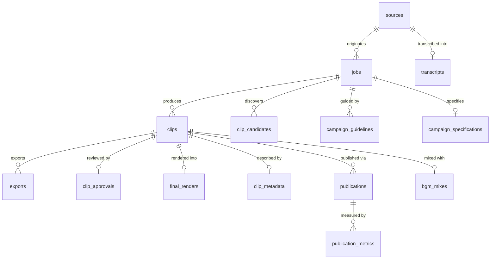

# AL AMR — Database Architecture & Schema Specification

## 1. Overview & Engine Configuration

AL AMR utilizes an embedded SQLite 3 database located at `paths.db_path()` (`/data/autoclip.db` in production).

### Engine Configuration:
- `PRAGMA journal_mode = WAL;` (Write-Ahead Logging for high concurrency).
- `PRAGMA synchronous = NORMAL;` (Ensures durability while minimizing write latency).
- `PRAGMA foreign_keys = ON;` (Strict referential integrity across all relationships).
- `PRAGMA busy_timeout = 60000;` (Wait up to 60s for lock acquisition before raising OperationalError).

---

## 2. Table Inventory (27 Normalized Tables)

| # | Table Name | Purpose | Primary Key | Key Foreign Keys |
| :--- | :--- | :--- | :--- | :--- |
| 1 | `sources` | Long-form video source records | `id` | - |
| 2 | `transcripts` | Full Whisper transcription text & word lists | `id` | `source_id` $	o$ `sources.id` |
| 3 | `clips` | Selected vertical clip segments | `id` | `job_id` $	o$ `jobs.id` |
| 4 | `clip_edits` | Operator trim and text edits | `id` | `clip_id` $	o$ `clips.id` |
| 5 | `exports` | Rendered output video pointers & Drive links | `id` | `clip_id` $	o$ `clips.id` |
| 6 | `campaign_evaluations` | Compliance scores against guidelines | `id` | `clip_id` $	o$ `clips.id`, `job_id` $	o$ `jobs.id` |
| 7 | `campaigns` | High-level marketing campaign groupings | `id` | - |
| 8 | `publishing_records` | Legacy publishing logs | `id` | `export_id` $	o$ `exports.id` |
| 9 | `jobs` | Core pipeline orchestration state machine | `id` | `source_id` $	o$ `sources.id` |
| 10 | `campaign_guidelines` | Raw uploaded PDF/DOCX brief records | `id` | `job_id` $	o$ `jobs.id` |
| 11 | `campaign_specifications`| Structured JSON campaign rules | `id` | `job_id` $	o$ `jobs.id` |
| 12 | `clip_candidates` | Discovered clip candidate segments | `id` | `job_id` $	o$ `jobs.id` |
| 13 | `clip_specifications` | Detailed candidate visual and pacing specs | `id` | `clip_id` $	o$ `clips.id` |
| 14 | `visual_compositions` | Reframing, face-tracking, and crop boxes | `id` | `clip_id` $	o$ `clips.id` |
| 15 | `retention_optimizations` | Hook pacing, gap tightening, and tail decays | `id` | `clip_id` $	o$ `clips.id` |
| 16 | `caption_optimizations` | Subtitle styles, word animations, colors | `id` | `clip_id` $	o$ `clips.id` |
| 17 | `bgm_assets` | Authoritative BGM audio files in vault | `id` | - |
| 18 | `bgm_mixes` | Audio mix parameters, ducking, LUFS results | `id` | `clip_id` $	o$ `clips.id` |
| 19 | `final_renders` | Step 22 final render packages & quality gates | `id` | `clip_id` $	o$ `clips.id` |
| 20 | `clip_metadata` | Step 23 SEO titles, descriptions, hashtags | `id` | `clip_id` $	o$ `clips.id` |
| 21 | `clip_approvals` | Step 24 Operator review state & history | `id` | `clip_id` $	o$ `clips.id` |
| 22 | `publications` | Step 25 Multi-platform publishing records | `id` | `clip_id` $	o$ `clips.id`, `final_render_id` $	o$ `final_renders.id` |
| 23 | `publishing_destinations`| Configured channel/account destinations | `id` | - |
| 24 | `publishing_queue` | Step 26 Scheduled publication queue items | `id` | `clip_id` $	o$ `clips.id`, `destination_id` $	o$ `publishing_destinations.id` |
| 25 | `publication_metrics` | Post-publish view, like, and share counts | `id` | `publication_id` $	o$ `publications.id` |
| 26 | `learning_audits` | Autonomous machine learning feedback loop | `id` | `clip_id` $	o$ `clips.id` |
| 27 | `app_credentials` | AES-256 encrypted credential vault storage | `key` | - |

---

## 3. Entity-Relationship Overview

