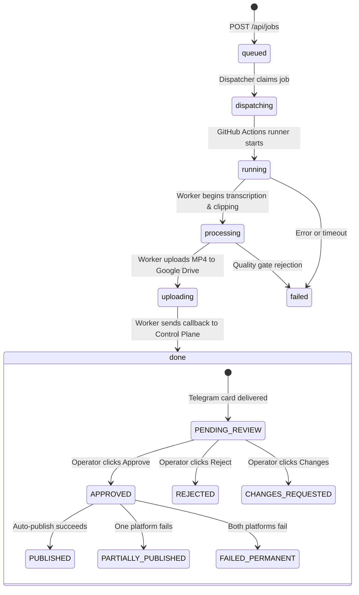

# AL AMR — Data Flow & State Transitions

## 1. Job Lifecycle State Machine



---

## 2. Telemetry & Data Payloads

### 2.1 Worker Callback Payload (`WorkerCallbackIn`)
When the GitHub Actions worker completes, it posts an HMAC-signed payload to `/api/jobs/worker_callback`:
```json
{
  "job_id": "job_69d32fefbe204b61",
  "status": "completed",
  "current_stage": "completed",
  "progress": 1.0,
  "final_renders": [
    {
      "clip_id": "60d59e0266f04ddd",
      "output_path": "/workspace/exports/clip_001.mp4",
      "duration": 24.27,
      "quality_score": 95.0,
      "quality_status": "RENDER_PASS",
      "drive_file_id": "195V2UCqKUKTl2O2QJVPFq9tutspfH16-",
      "drive_web_view_link": "https://drive.google.com/file/d/195V.../view"
    }
  ],
  "clip_metadata": [
    {
      "clip_id": "60d59e0266f04ddd",
      "final_title": "Unlocking AI Automation",
      "final_description": "Transforming operations in 2026.",
      "final_hashtags": ["AI", "Automation", "Shorts"],
      "compliance_status": "SEO_PASS"
    }
  ]
}
```

### 2.2 Decoupled Clip Reconciliation Data Flow
If a user approves a clip rendered on an ephemeral worker whose SQLite state was not synced to the Control Plane:
1. Operator clicks `[ ✅ APPROVE & PUBLISH ]` on Telegram.
2. `review_bot.py` intercepts `handle_telegram_update`.
3. `_reconcile_remote_clip()` parses title, hook, duration, hashtags, description, Drive link, and Telegram `file_id` directly from Telegram message.
4. Ensures prerequisite `Source` (`src_remote`) and `Job` exist in local SQLite.
5. Reconstructs `Clip`, `Export`, `ClipMetadataRecord`, `FinalRenderRecord`, and `ClipApprovalRecord`.
6. Answers callback query immediately to stop the button spinner.
7. Dispatches background publishing task using Drive or Telegram file download fallback.
