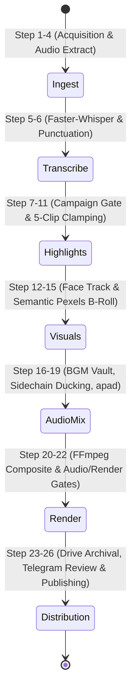

# AL AMR — Pipeline Specification & Stage Contracts

## 1. Stage Sequence Overview

The AL AMR pipeline transforms raw long-form input into 5 verified, published vertical short clips across 26 discrete steps grouped into 7 pipeline stages:

---

## 2. Stage Contracts

### Stage 1: Ingest & Source Acquisition (Steps 1–4)
- **Input**: Source URL (YouTube, Vimeo, direct link) or local file upload.
- **Engines**: `YouTubeSourceAcquirer`, `CobaltAcquisitionProvider`, `PipedProvider`, `InvidiousProvider`.
- **Output**: Source video (`source.mp4`) and extracted 16 kHz mono WAV (`source_audio.wav`).
- **Gate**: Media integrity check (video stream $\ge 720p$, audio stream present, duration $\ge 30s$).

### Stage 2: Transcription & Alignment (Steps 5–6)
- **Input**: `source_audio.wav`.
- **Engine**: `Faster-Whisper` (model: `base`, `small`, or `medium` based on availability).
- **Output**: `Transcript` containing sorted list of `Word` objects (`start`, `end`, `text`, `probability`).
- **Gate**: Non-empty transcript; word density $\ge 1.0$ word/second.

### Stage 3: Candidate Discovery & 5-Clip Guarantee (Steps 7–11)
- **Input**: `Transcript`, `CampaignBriefRecord` (rules, keywords, banned topics).
- **Engines**: `CandidateDiscoveryEngine`, `ClipAssemblyEngine`, `DurationEnforcer`.
- **Rules**:
  - Exactly 5 non-overlapping candidates selected.
  - Duration clamped strictly to [20.0s, 30.0s].
  - Clip ends strictly on true sentence terminals (`.`, `!`, `?`); ellipses (`...`) and filler words (`just`, `really`, `you know`) rejected.
- **Gate**: `INSUFFICIENT_VALID_CLIPS` triggered if fewer than 5 valid candidates exist.

### Stage 4: Semantic Visuals & B-Roll Injection (Steps 12–15)
- **Input**: Candidate transcript slice, source video.
- **Engines**: `SemanticParser`, `PexelsClient`, `CardGenerator`, `VisualEnhancer`.
- **Logic**:
  - Maps concrete nouns and verbs to visual concepts.
  - Detects A-roll talking-head gaps $> 3.0s$.
  - Downloads 9:16 portrait stock footage from Pexels API.
  - Fallback: Smooth punch-in (1.15x digital zoom) when stock footage is unavailable.

### Stage 5: Audio Mixing & Loudness Engineering (Steps 16–19)
- **Input**: Speech audio, BGM track (`BGMAssetRecord`).
- **Engine**: `BGMMixingEngine`.
- **Logic**:
  - Safe margin seeking (`duration_s + 1.0`) prevents keyframe starving.
  - `apad=whole_dur={duration_s}` pads speech so audio never terminates early.
  - Sidechain compression ducks BGM to -18 dB during speech.
  - `dropout_transition=0` with `atrim=0:{duration_s}` guarantees audio matches container video duration.
- **Gate**: `AudioQualityGate`: Integrated loudness -14.0 LUFS ($\pm 1.5$), true peak $\le -1.5$ dBTP.

### Stage 6: Final Rendering & Packaging (Steps 20–22)
- **Input**: Mixed audio, A-roll video, B-roll overlays, ASS subtitle script.
- **Engine**: `FinalRenderEngine`, `FFmpeg`.
- **Output**: Final vertical MP4 (`final.mp4`) at 1080x1920, 30 fps, H.264/AAC.
- **Gate**: `FinalRenderGate`: accepts `RENDER_PASS` or `RENDER_WARN`.

### Stage 7: Archival, Review & Publishing (Steps 23–26)
- **Input**: Rendered MP4, SEO metadata.
- **Engines**: `GoogleDriveStorage`, `TelegramReviewBot`, `PublishingService`.
- **Logic**:
  - Uploads MP4 to Google Drive, obtains web view link.
  - Sends video review card to Telegram chat with inline approve/reject buttons.
  - On operator approval, executes OAuth upload to YouTube Shorts and Meta Graph API upload to Instagram Reels.
